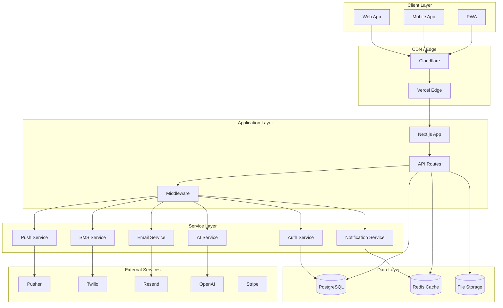
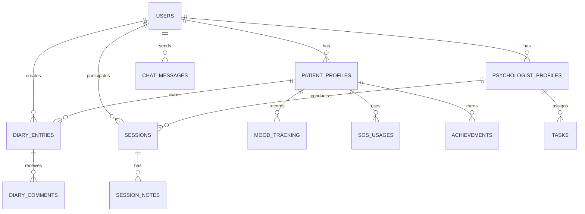

# 🏗️ CÁRIS SaaS Pro - Arquitetura do Sistema

Documentação técnica da arquitetura e design do sistema CÁRIS SaaS Pro.

## 📋 Índice

- [Visão Geral](#visão-geral)
- [Arquitetura de Alto Nível](#arquitetura-de-alto-nível)
- [Stack Tecnológico](#stack-tecnológico)
- [Estrutura do Frontend](#estrutura-do-frontend)
- [Estrutura do Backend](#estrutura-do-backend)
- [Banco de Dados](#banco-de-dados)
- [Autenticação e Autorização](#autenticação-e-autorização)
- [Sistema de Notificações](#sistema-de-notificações)
- [Integrações Externas](#integrações-externas)
- [Segurança](#segurança)
- [Performance](#performance)
- [Escalabilidade](#escalabilidade)
- [Monitoramento](#monitoramento)

---

## 🎯 Visão Geral

O **CÁRIS SaaS Pro** é uma plataforma de saúde mental construída com arquitetura moderna, seguindo princípios de **Clean Architecture**, **Domain-Driven Design** e **Microservices**.

### Principais Características

- **Arquitetura Serverless** com Next.js API Routes
- **Real-time** com WebSockets e Server-Sent Events
- **Progressive Web App** (PWA) capabilities
- **Multi-tenancy** para diferentes organizações
- **GDPR/LGPD Compliant** por design
- **High Availability** e auto-scaling

---

## 🏛️ Arquitetura de Alto Nível



---

## 🛠 Stack Tecnológico

### Frontend
```typescript
// Core Framework
"next": "15.2.4"          // React Framework
"react": "19"             // UI Library
"typescript": "5"         // Type Safety

// Styling & UI
"tailwindcss": "3.4.17"   // Utility CSS
"@radix-ui/react-*"       // Accessible Components
"framer-motion": "latest"  // Animations
"lucide-react": "0.454.0" // Icons

// State Management
"zustand": "latest"       // Global State
"react-hook-form": "7.54.1" // Form State
"@tanstack/react-query": "latest" // Server State

// Charts & Visualization
"recharts": "latest"      // Data Visualization
"chart.js": "latest"      // Advanced Charts
```

### Backend
```typescript
// Runtime & Framework
"node": "18+"             // Runtime
"next": "15.2.4"          // Full-stack Framework

// Database & ORM
"drizzle-orm": "latest"   // Type-safe ORM
"@neondatabase/serverless": "latest" // PostgreSQL

// Authentication
"jose": "latest"          // JWT handling
"bcryptjs": "latest"      // Password hashing

// Real-time
"pusher": "latest"        // WebSocket service
"pusher-js": "latest"     // Client library

// File Upload
"@aws-sdk/client-s3": "latest" // AWS S3
"multer": "latest"        // File handling
```

### DevOps & Infrastructure
```yaml
# Hosting
vercel: "Platform"        # Serverless hosting
cloudflare: "CDN"         # CDN and security

# Database
neon: "PostgreSQL"        # Managed PostgreSQL
upstash: "Redis"          # Managed Redis

# Monitoring
sentry: "Error tracking"  # Error monitoring
vercel-analytics: "Analytics" # Performance analytics

# CI/CD
github-actions: "CI/CD"   # Automation
husky: "Git hooks"        # Pre-commit hooks
```

---

## 🎨 Estrutura do Frontend

### Component Architecture

```
components/
├── ui/                   # Base UI Components (Radix)
│   ├── button.tsx       # Atomic components
│   ├── input.tsx
│   └── dialog.tsx
├── composite/           # Composite Components
│   ├── data-table.tsx   # Reusable tables
│   ├── charts/          # Chart components
│   └── forms/           # Form components
├── feature/             # Feature-specific components
│   ├── chat/            # Chat system
│   ├── diary/           # Diary functionality
│   └── sessions/        # Session management
└── layout/              # Layout components
    ├── header.tsx
    ├── sidebar.tsx
    └── footer.tsx
```

### State Management Pattern

```typescript
// stores/useAuthStore.ts
import { create } from 'zustand';
import { persist } from 'zustand/middleware';

interface AuthState {
  user: User | null;
  token: string | null;
  isAuthenticated: boolean;
  login: (email: string, password: string) => Promise<void>;
  logout: () => void;
  refreshToken: () => Promise<void>;
}

export const useAuthStore = create<AuthState>()(
  persist(
    (set, get) => ({
      user: null,
      token: null,
      isAuthenticated: false,
      
      login: async (email, password) => {
        const response = await fetch('/api/auth/login', {
          method: 'POST',
          headers: { 'Content-Type': 'application/json' },
          body: JSON.stringify({ email, password })
        });
        
        const { data } = await response.json();
        
        set({
          user: data.user,
          token: data.token,
          isAuthenticated: true
        });
      },
      
      logout: () => {
        set({
          user: null,
          token: null,
          isAuthenticated: false
        });
      },
      
      refreshToken: async () => {
        // Implementation...
      }
    }),
    {
      name: 'auth-storage',
      partialize: (state) => ({
        token: state.token,
        user: state.user
      })
    }
  )
);
```

### Route Structure (App Router)

```
app/
├── (auth)/              # Auth route group
│   ├── login/
│   └── register/
├── dashboard/           # Protected routes
│   ├── (patient)/       # Patient-specific routes
│   │   ├── diary/
│   │   ├── sessions/
│   │   └── chat/
│   ├── (psychologist)/  # Psychologist routes
│   │   ├── patients/
│   │   ├── schedule/
│   │   └── reports/
│   └── layout.tsx       # Dashboard layout
├── admin/               # Admin routes
│   ├── users/
│   └── plans/
├── api/                 # API routes
│   ├── auth/
│   ├── patient/
│   ├── psychologist/
│   └── admin/
└── globals.css          # Global styles
```

---

## ⚙️ Estrutura do Backend

### API Route Organization

```typescript
// app/api/patient/diary/route.ts
import { NextRequest, NextResponse } from 'next/server';
import { validateAuth } from '@/lib/auth';
import { DiaryService } from '@/services/DiaryService';

export async function GET(request: NextRequest) {
  try {
    const user = await validateAuth(request);
    if (!user || user.role !== 'patient') {
      return NextResponse.json({ error: 'Unauthorized' }, { status: 401 });
    }

    const diaryService = new DiaryService();
    const entries = await diaryService.getEntries(user.id);

    return NextResponse.json({
      success: true,
      data: entries
    });
  } catch (error) {
    return NextResponse.json({
      success: false,
      error: error.message
    }, { status: 500 });
  }
}

export async function POST(request: NextRequest) {
  // Implementation...
}
```

### Service Layer Pattern

```typescript
// services/DiaryService.ts
import { db } from '@/db';
import { diaryEntries } from '@/db/schema';
import { eq, desc } from 'drizzle-orm';

export class DiaryService {
  async getEntries(patientId: number, options?: {
    page?: number;
    limit?: number;
    mood?: number;
  }) {
    const { page = 1, limit = 10, mood } = options || {};
    
    let query = db
      .select()
      .from(diaryEntries)
      .where(eq(diaryEntries.patientId, patientId))
      .orderBy(desc(diaryEntries.createdAt))
      .limit(limit)
      .offset((page - 1) * limit);

    if (mood) {
      query = query.where(eq(diaryEntries.mood, mood));
    }

    return await query;
  }

  async createEntry(patientId: number, data: CreateDiaryEntryData) {
    const [entry] = await db
      .insert(diaryEntries)
      .values({
        patientId,
        ...data,
        createdAt: new Date(),
        updatedAt: new Date()
      })
      .returning();

    // Trigger notifications
    await this.notifyPsychologist(patientId, entry);

    return entry;
  }

  private async notifyPsychologist(patientId: number, entry: DiaryEntry) {
    // Implementation...
  }
}
```

### Middleware Stack

```typescript
// middleware.ts
import { NextRequest, NextResponse } from 'next/server';
import { rateLimitMiddleware } from '@/lib/rate-limit';
import { authMiddleware } from '@/lib/auth-middleware';
import { corsMiddleware } from '@/lib/cors';
import { securityHeadersMiddleware } from '@/lib/security';

export async function middleware(request: NextRequest) {
  let response = NextResponse.next();

  // Apply middlewares in order
  response = await corsMiddleware(request, response);
  response = await securityHeadersMiddleware(request, response);
  
  // Rate limiting for API routes
  if (request.nextUrl.pathname.startsWith('/api/')) {
    const rateLimitResult = await rateLimitMiddleware(request);
    if (!rateLimitResult.success) {
      return NextResponse.json(
        { error: 'Rate limit exceeded' },
        { status: 429 }
      );
    }
  }

  // Authentication for protected routes
  if (request.nextUrl.pathname.startsWith('/dashboard/') ||
      request.nextUrl.pathname.startsWith('/admin/')) {
    return await authMiddleware(request, response);
  }

  return response;
}

export const config = {
  matcher: [
    '/dashboard/:path*',
    '/admin/:path*',
    '/api/:path*'
  ]
};
```

---

## 🗄️ Banco de Dados

### Schema Design

```typescript
// db/schema.ts
import { pgTable, serial, text, timestamp, boolean, integer } from 'drizzle-orm/pg-core';

// Core entities
export const users = pgTable('users', {
  id: serial('id').primaryKey(),
  email: varchar('email', { length: 255 }).notNull().unique(),
  passwordHash: text('password_hash').notNull(),
  name: text('name').notNull(),
  role: text('role').notNull(), // 'patient' | 'psychologist' | 'admin'
  isActive: boolean('is_active').default(true),
  createdAt: timestamp('created_at').defaultNow(),
  updatedAt: timestamp('updated_at').defaultNow()
});

export const patientProfiles = pgTable('patient_profiles', {
  id: serial('id').primaryKey(),
  userId: integer('user_id').references(() => users.id).notNull(),
  psychologistId: integer('psychologist_id').references(() => users.id),
  currentCycle: text('current_cycle').default('Criar'),
  birthDate: date('birth_date'),
  phone: varchar('phone', { length: 20 }),
  emergencyContact: varchar('emergency_contact', { length: 20 }),
  avatar: text('avatar'),
  createdAt: timestamp('created_at').defaultNow(),
  updatedAt: timestamp('updated_at').defaultNow()
});

// Audit table for sensitive operations
export const auditLog = pgTable('audit_log', {
  id: serial('id').primaryKey(),
  userId: integer('user_id').references(() => users.id),
  action: text('action').notNull(),
  entity: text('entity').notNull(),
  entityId: integer('entity_id'),
  oldValues: jsonb('old_values'),
  newValues: jsonb('new_values'),
  ipAddress: inet('ip_address'),
  userAgent: text('user_agent'),
  createdAt: timestamp('created_at').defaultNow()
});
```

### Database Relationships



### Data Access Pattern

```typescript
// repositories/UserRepository.ts
import { db } from '@/db';
import { users, patientProfiles, psychologistProfiles } from '@/db/schema';
import { eq, and } from 'drizzle-orm';

export class UserRepository {
  async findByEmail(email: string) {
    const [user] = await db
      .select()
      .from(users)
      .where(and(
        eq(users.email, email),
        eq(users.isActive, true)
      ));
    
    return user;
  }

  async findWithProfile(userId: number) {
    const user = await db
      .select({
        id: users.id,
        email: users.email,
        name: users.name,
        role: users.role,
        profile: {
          patient: patientProfiles,
          psychologist: psychologistProfiles
        }
      })
      .from(users)
      .leftJoin(patientProfiles, eq(users.id, patientProfiles.userId))
      .leftJoin(psychologistProfiles, eq(users.id, psychologistProfiles.userId))
      .where(eq(users.id, userId));

    return user;
  }

  async updateLastLogin(userId: number) {
    await db
      .update(users)
      .set({ 
        lastLoginAt: new Date(),
        updatedAt: new Date()
      })
      .where(eq(users.id, userId));
  }
}
```

---

## 🔐 Autenticação e Autorização

### JWT Token Strategy

```typescript
// lib/auth.ts
import { SignJWT, jwtVerify } from 'jose';
import { cookies } from 'next/headers';

const secret = new TextEncoder().encode(process.env.JWT_SECRET);

export async function signJWT(payload: any, expiresIn: string = '24h') {
  return await new SignJWT(payload)
    .setProtectedHeader({ alg: 'HS256' })
    .setExpirationTime(expiresIn)
    .setIssuedAt()
    .sign(secret);
}

export async function verifyJWT(token: string) {
  try {
    const { payload } = await jwtVerify(token, secret);
    return payload;
  } catch (error) {
    throw new Error('Invalid token');
  }
}

export async function getSession() {
  const cookieStore = cookies();
  const token = cookieStore.get('auth-token')?.value;
  
  if (!token) return null;
  
  try {
    const payload = await verifyJWT(token);
    return payload;
  } catch {
    return null;
  }
}
```

### Role-Based Access Control

```typescript
// lib/rbac.ts
export enum Role {
  ADMIN = 'admin',
  PSYCHOLOGIST = 'psychologist',
  PATIENT = 'patient'
}

export enum Permission {
  READ_PATIENT_DATA = 'read:patient_data',
  WRITE_PATIENT_DATA = 'write:patient_data',
  MANAGE_USERS = 'manage:users',
  VIEW_REPORTS = 'view:reports',
  MANAGE_SESSIONS = 'manage:sessions'
}

const rolePermissions: Record<Role, Permission[]> = {
  [Role.ADMIN]: [
    Permission.MANAGE_USERS,
    Permission.VIEW_REPORTS,
    Permission.READ_PATIENT_DATA
  ],
  [Role.PSYCHOLOGIST]: [
    Permission.READ_PATIENT_DATA,
    Permission.WRITE_PATIENT_DATA,
    Permission.MANAGE_SESSIONS,
    Permission.VIEW_REPORTS
  ],
  [Role.PATIENT]: [
    Permission.WRITE_PATIENT_DATA // Only own data
  ]
};

export function hasPermission(userRole: Role, permission: Permission): boolean {
  return rolePermissions[userRole]?.includes(permission) || false;
}

export function canAccessResource(
  userRole: Role, 
  resourceOwnerId: number, 
  currentUserId: number
): boolean {
  // Admins can access everything
  if (userRole === Role.ADMIN) return true;
  
  // Users can access their own resources
  if (resourceOwnerId === currentUserId) return true;
  
  // Psychologists can access their patients' data
  if (userRole === Role.PSYCHOLOGIST) {
    // Check if patient is assigned to this psychologist
    return checkPsychologistPatientRelation(currentUserId, resourceOwnerId);
  }
  
  return false;
}
```

---

## 🔔 Sistema de Notificações

### Multi-Channel Architecture

```typescript
// services/NotificationService.ts
export interface NotificationChannel {
  send(notification: Notification): Promise<void>;
}

export class EmailChannel implements NotificationChannel {
  async send(notification: Notification) {
    const emailService = new EmailService();
    await emailService.send({
      to: notification.recipient.email,
      subject: notification.title,
      html: await this.renderTemplate(notification)
    });
  }
}

export class SMSChannel implements NotificationChannel {
  async send(notification: Notification) {
    const smsService = new SMSService();
    await smsService.send(
      notification.recipient.phone,
      notification.content
    );
  }
}

export class PushChannel implements NotificationChannel {
  async send(notification: Notification) {
    const pushService = new PushNotificationService();
    await pushService.send(
      notification.recipient.pushSubscription,
      {
        title: notification.title,
        body: notification.content,
        data: notification.metadata
      }
    );
  }
}

export class NotificationService {
  private channels: Map<string, NotificationChannel> = new Map();

  constructor() {
    this.channels.set('email', new EmailChannel());
    this.channels.set('sms', new SMSChannel());
    this.channels.set('push', new PushChannel());
  }

  async send(notification: Notification) {
    const userPreferences = await this.getUserPreferences(notification.recipientId);
    
    for (const channelType of notification.channels) {
      if (userPreferences[channelType] && this.channels.has(channelType)) {
        const channel = this.channels.get(channelType)!;
        await channel.send(notification);
      }
    }
  }
}
```

### Real-time Events

```typescript
// lib/realtime.ts
import { pusherServer } from '@/lib/pusher';

export class RealtimeService {
  static async publishToUser(userId: number, event: string, data: any) {
    await pusherServer.trigger(`user-${userId}`, event, data);
  }

  static async publishToRole(role: string, event: string, data: any) {
    await pusherServer.trigger(`role-${role}`, event, data);
  }

  static async publishSOSAlert(patientId: number, psychologistId: number) {
    const sosData = {
      patientId,
      timestamp: new Date().toISOString(),
      severity: 'high'
    };

    // Notify psychologist immediately
    await this.publishToUser(psychologistId, 'sos-alert', sosData);
    
    // Notify emergency contacts
    await this.publishToRole('admin', 'sos-alert', sosData);
  }
}
```

---

## 🔗 Integrações Externas

### Service Integration Pattern

```typescript
// services/integrations/BaseIntegration.ts
export abstract class BaseIntegration {
  protected apiKey: string;
  protected baseUrl: string;
  protected timeout: number = 5000;

  constructor(config: IntegrationConfig) {
    this.apiKey = config.apiKey;
    this.baseUrl = config.baseUrl;
  }

  protected async makeRequest<T>(
    endpoint: string,
    options: RequestInit = {}
  ): Promise<T> {
    const controller = new AbortController();
    const timeoutId = setTimeout(() => controller.abort(), this.timeout);

    try {
      const response = await fetch(`${this.baseUrl}${endpoint}`, {
        ...options,
        signal: controller.signal,
        headers: {
          'Authorization': `Bearer ${this.apiKey}`,
          'Content-Type': 'application/json',
          ...options.headers
        }
      });

      clearTimeout(timeoutId);

      if (!response.ok) {
        throw new Error(`API Error: ${response.status}`);
      }

      return await response.json();
    } catch (error) {
      clearTimeout(timeoutId);
      throw error;
    }
  }
}

// services/integrations/OpenAIIntegration.ts
export class OpenAIIntegration extends BaseIntegration {
  async generateMoodInsight(diaryEntry: DiaryEntry): Promise<string> {
    const response = await this.makeRequest<OpenAIResponse>('/completions', {
      method: 'POST',
      body: JSON.stringify({
        model: 'gpt-4',
        messages: [{
          role: 'system',
          content: 'Você é um assistente de saúde mental especializado...'
        }, {
          role: 'user',
          content: `Analise esta entrada de diário: ${diaryEntry.content}`
        }],
        max_tokens: 500
      })
    });

    return response.choices[0].message.content;
  }
}
```

### Circuit Breaker Pattern

```typescript
// lib/circuit-breaker.ts
export class CircuitBreaker {
  private failures: number = 0;
  private state: 'CLOSED' | 'OPEN' | 'HALF_OPEN' = 'CLOSED';
  private nextAttempt: number = 0;

  constructor(
    private failureThreshold: number = 5,
    private resetTimeout: number = 60000
  ) {}

  async execute<T>(fn: () => Promise<T>): Promise<T> {
    if (this.state === 'OPEN') {
      if (Date.now() < this.nextAttempt) {
        throw new Error('Circuit breaker is OPEN');
      }
      this.state = 'HALF_OPEN';
    }

    try {
      const result = await fn();
      this.onSuccess();
      return result;
    } catch (error) {
      this.onFailure();
      throw error;
    }
  }

  private onSuccess() {
    this.failures = 0;
    this.state = 'CLOSED';
  }

  private onFailure() {
    this.failures++;
    if (this.failures >= this.failureThreshold) {
      this.state = 'OPEN';
      this.nextAttempt = Date.now() + this.resetTimeout;
    }
  }
}
```

---

## 🛡️ Segurança

### Data Encryption

```typescript
// lib/encryption.ts
import { createCipheriv, createDecipheriv, randomBytes, scrypt } from 'crypto';
import { promisify } from 'util';

const algorithm = 'aes-256-gcm';
const scryptAsync = promisify(scrypt);

export class EncryptionService {
  private static async deriveKey(password: string, salt: Buffer): Promise<Buffer> {
    return (await scryptAsync(password, salt, 32)) as Buffer;
  }

  static async encrypt(text: string, password: string): Promise<string> {
    const salt = randomBytes(16);
    const iv = randomBytes(16);
    const key = await this.deriveKey(password, salt);
    
    const cipher = createCipheriv(algorithm, key, iv);
    
    let encrypted = cipher.update(text, 'utf8', 'hex');
    encrypted += cipher.final('hex');
    
    const authTag = cipher.getAuthTag();
    
    return `${salt.toString('hex')}:${iv.toString('hex')}:${authTag.toString('hex')}:${encrypted}`;
  }

  static async decrypt(encryptedData: string, password: string): Promise<string> {
    const [saltHex, ivHex, authTagHex, encrypted] = encryptedData.split(':');
    
    const salt = Buffer.from(saltHex, 'hex');
    const iv = Buffer.from(ivHex, 'hex');
    const authTag = Buffer.from(authTagHex, 'hex');
    const key = await this.deriveKey(password, salt);
    
    const decipher = createDecipheriv(algorithm, key, iv);
    decipher.setAuthTag(authTag);
    
    let decrypted = decipher.update(encrypted, 'hex', 'utf8');
    decrypted += decipher.final('utf8');
    
    return decrypted;
  }
}
```

### Input Validation

```typescript
// lib/validation.ts
import { z } from 'zod';

export const schemas = {
  diaryEntry: z.object({
    title: z.string().min(1).max(200),
    content: z.string().min(1).max(5000),
    mood: z.number().int().min(1).max(5),
    tags: z.array(z.string()).max(10),
    isPrivate: z.boolean().default(false)
  }),

  sessionSchedule: z.object({
    patientId: z.number().int().positive(),
    sessionDate: z.string().datetime(),
    durationMinutes: z.number().int().min(30).max(120),
    type: z.enum(['online', 'presencial']),
    notes: z.string().max(1000).optional()
  }),

  userProfile: z.object({
    name: z.string().min(2).max(100),
    phone: z.string().regex(/^\+?[\d\s\-\(\)]+$/),
    birthDate: z.string().date().optional()
  })
};

export function validateInput<T>(schema: z.ZodSchema<T>, data: unknown): T {
  try {
    return schema.parse(data);
  } catch (error) {
    if (error instanceof z.ZodError) {
      throw new ValidationError(error.errors);
    }
    throw error;
  }
}
```

---

## ⚡ Performance

### Caching Strategy

```typescript
// lib/cache.ts
import { Redis } from '@upstash/redis';

export class CacheService {
  private redis = new Redis({
    url: process.env.UPSTASH_REDIS_URL!,
    token: process.env.UPSTASH_REDIS_TOKEN!
  });

  async get<T>(key: string): Promise<T | null> {
    const value = await this.redis.get(key);
    return value as T;
  }

  async set(key: string, value: any, ttl: number = 3600): Promise<void> {
    await this.redis.setex(key, ttl, JSON.stringify(value));
  }

  async invalidate(pattern: string): Promise<void> {
    const keys = await this.redis.keys(pattern);
    if (keys.length > 0) {
      await this.redis.del(...keys);
    }
  }

  // Cache patterns
  userKey(userId: number): string {
    return `user:${userId}`;
  }

  diaryEntriesKey(patientId: number, page: number): string {
    return `diary:${patientId}:page:${page}`;
  }

  sessionStatsKey(psychologistId: number): string {
    return `stats:sessions:${psychologistId}`;
  }
}

// Usage with React Query
export function useDiaryEntries(patientId: number, page: number = 1) {
  return useQuery({
    queryKey: ['diary', patientId, page],
    queryFn: async () => {
      const response = await fetch(`/api/patient/diary?page=${page}`);
      return response.json();
    },
    staleTime: 5 * 60 * 1000, // 5 minutes
    cacheTime: 10 * 60 * 1000  // 10 minutes
  });
}
```

### Database Optimization

```typescript
// Database query optimization
export class OptimizedQueries {
  // Use database views for complex queries
  static async getPatientDashboard(patientId: number) {
    // Use materialized view instead of complex joins
    return await db.execute(sql`
      SELECT * FROM patient_dashboard_view 
      WHERE patient_id = ${patientId}
    `);
  }

  // Implement pagination with cursor-based approach for large datasets
  static async getDiaryEntriesCursor(
    patientId: number, 
    cursor?: string, 
    limit: number = 20
  ) {
    let query = db
      .select()
      .from(diaryEntries)
      .where(eq(diaryEntries.patientId, patientId))
      .orderBy(desc(diaryEntries.createdAt))
      .limit(limit);

    if (cursor) {
      query = query.where(lt(diaryEntries.createdAt, new Date(cursor)));
    }

    return await query;
  }

  // Use database functions for complex calculations
  static async getMoodStatistics(patientId: number, period: string) {
    return await db.execute(sql`
      SELECT calculate_mood_stats(${patientId}, ${period})
    `);
  }
}
```

---

## 📈 Escalabilidade

### Horizontal Scaling Strategy

```typescript
// lib/scaling.ts
export class LoadBalancer {
  private servers: string[] = [
    'server1.caris.com',
    'server2.caris.com',
    'server3.caris.com'
  ];

  private currentIndex = 0;

  getNextServer(): string {
    const server = this.servers[this.currentIndex];
    this.currentIndex = (this.currentIndex + 1) % this.servers.length;
    return server;
  }

  async healthCheck(): Promise<string[]> {
    const healthyServers = [];
    
    for (const server of this.servers) {
      try {
        const response = await fetch(`https://${server}/api/health`);
        if (response.ok) {
          healthyServers.push(server);
        }
      } catch {
        // Server is down
      }
    }
    
    return healthyServers;
  }
}

// Database read replicas
export class DatabaseRouter {
  private writeDb = createConnection(process.env.WRITE_DB_URL!);
  private readReplicas = [
    createConnection(process.env.READ_REPLICA_1_URL!),
    createConnection(process.env.READ_REPLICA_2_URL!)
  ];

  getWriteConnection() {
    return this.writeDb;
  }

  getReadConnection() {
    // Round-robin between read replicas
    const index = Math.floor(Math.random() * this.readReplicas.length);
    return this.readReplicas[index];
  }
}
```

### Auto-scaling Configuration

```yaml
# kubernetes-deployment.yaml
apiVersion: apps/v1
kind: Deployment
metadata:
  name: caris-app
spec:
  replicas: 3
  selector:
    matchLabels:
      app: caris
  template:
    metadata:
      labels:
        app: caris
    spec:
      containers:
      - name: caris
        image: caris:latest
        resources:
          requests:
            memory: "256Mi"
            cpu: "250m"
          limits:
            memory: "512Mi"
            cpu: "500m"
---
apiVersion: autoscaling/v2
kind: HorizontalPodAutoscaler
metadata:
  name: caris-hpa
spec:
  scaleTargetRef:
    apiVersion: apps/v1
    kind: Deployment
    name: caris-app
  minReplicas: 3
  maxReplicas: 20
  metrics:
  - type: Resource
    resource:
      name: cpu
      target:
        type: Utilization
        averageUtilization: 70
  - type: Resource
    resource:
      name: memory
      target:
        type: Utilization
        averageUtilization: 80
```

---

## 📊 Monitoramento

### Application Metrics

```typescript
// lib/metrics.ts
import { StatsD } from 'node-statsd';

export class MetricsService {
  private client = new StatsD({
    host: process.env.STATSD_HOST,
    port: parseInt(process.env.STATSD_PORT || '8125')
  });

  // Business metrics
  recordDiaryEntry(patientId: number) {
    this.client.increment('diary.entries.created');
    this.client.gauge(`diary.entries.patient.${patientId}`, 1);
  }

  recordSessionCompleted(durationMinutes: number) {
    this.client.increment('sessions.completed');
    this.client.histogram('sessions.duration', durationMinutes);
  }

  recordSOSUsage(tool: string) {
    this.client.increment('sos.usage.total');
    this.client.increment(`sos.usage.${tool}`);
  }

  // Performance metrics
  recordApiLatency(endpoint: string, latency: number) {
    this.client.timing(`api.latency.${endpoint}`, latency);
  }

  recordDatabaseQuery(query: string, duration: number) {
    this.client.timing(`db.query.${query}`, duration);
  }

  // Error tracking
  recordError(error: Error, context: string) {
    this.client.increment(`errors.${context}`);
    
    // Send to Sentry for detailed tracking
    if (process.env.NODE_ENV === 'production') {
      Sentry.captureException(error, { extra: { context } });
    }
  }
}

// Usage in API routes
export async function withMetrics<T>(
  fn: () => Promise<T>,
  metricName: string
): Promise<T> {
  const startTime = Date.now();
  const metrics = new MetricsService();

  try {
    const result = await fn();
    const duration = Date.now() - startTime;
    metrics.recordApiLatency(metricName, duration);
    return result;
  } catch (error) {
    metrics.recordError(error as Error, metricName);
    throw error;
  }
}
```

### Health Monitoring

```typescript
// app/api/health/route.ts
export async function GET() {
  const health = {
    status: 'healthy',
    timestamp: new Date().toISOString(),
    version: process.env.APP_VERSION || '1.0.0',
    services: {}
  };

  try {
    // Database health
    await db.select().from(users).limit(1);
    health.services.database = 'healthy';
  } catch {
    health.services.database = 'unhealthy';
    health.status = 'degraded';
  }

  try {
    // Redis health
    const cache = new CacheService();
    await cache.set('health-check', 'ok', 10);
    health.services.cache = 'healthy';
  } catch {
    health.services.cache = 'unhealthy';
    health.status = 'degraded';
  }

  try {
    // External services health
    await fetch('https://api.pusher.com/health', { method: 'HEAD' });
    health.services.realtime = 'healthy';
  } catch {
    health.services.realtime = 'unhealthy';
  }

  const statusCode = health.status === 'healthy' ? 200 : 503;
  return NextResponse.json(health, { status: statusCode });
}
```

---

## 🔮 Evolução da Arquitetura

### Migração para Microservices

```typescript
// Future microservices architecture
const services = {
  'user-service': 'https://user-service.caris.com',
  'diary-service': 'https://diary-service.caris.com',
  'notification-service': 'https://notification-service.caris.com',
  'session-service': 'https://session-service.caris.com',
  'analytics-service': 'https://analytics-service.caris.com'
};

// Service mesh communication
export class ServiceMesh {
  async callService(service: string, endpoint: string, data?: any) {
    const baseUrl = services[service];
    if (!baseUrl) {
      throw new Error(`Service ${service} not found`);
    }

    return await fetch(`${baseUrl}${endpoint}`, {
      method: data ? 'POST' : 'GET',
      headers: {
        'Content-Type': 'application/json',
        'Authorization': `Bearer ${await this.getServiceToken()}`
      },
      body: data ? JSON.stringify(data) : undefined
    });
  }

  private async getServiceToken(): Promise<string> {
    // Implementation for service-to-service authentication
    return 'service-token';
  }
}
```

### Event-Driven Architecture

```typescript
// Event sourcing implementation
export interface DomainEvent {
  id: string;
  type: string;
  aggregateId: string;
  aggregateType: string;
  data: any;
  metadata: {
    timestamp: Date;
    userId: string;
    version: number;
  };
}

export class EventStore {
  async append(events: DomainEvent[]): Promise<void> {
    await db.insert(eventStore).values(events);
    
    // Publish to event bus
    for (const event of events) {
      await this.publish(event);
    }
  }

  async getEvents(aggregateId: string): Promise<DomainEvent[]> {
    return await db
      .select()
      .from(eventStore)
      .where(eq(eventStore.aggregateId, aggregateId))
      .orderBy(eventStore.version);
  }

  private async publish(event: DomainEvent): Promise<void> {
    // Publish to message queue (AWS SQS, RabbitMQ, etc.)
    await messageQueue.publish(event.type, event);
  }
}
```

---

**CÁRIS SaaS Pro Architecture** - Desenvolvido com 💚 por [Kalleby Evangelho](https://github.com/KallebyX)

*"Architecture is about making decisions that allow for change"* 