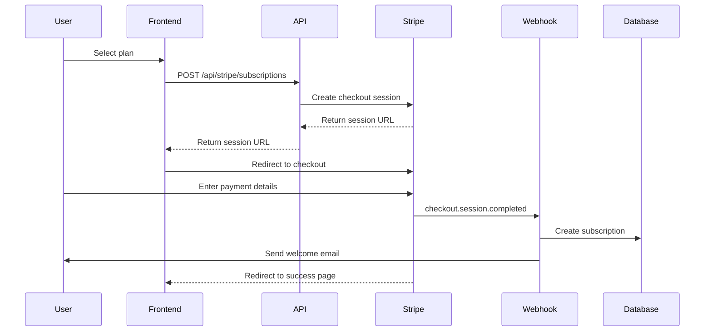
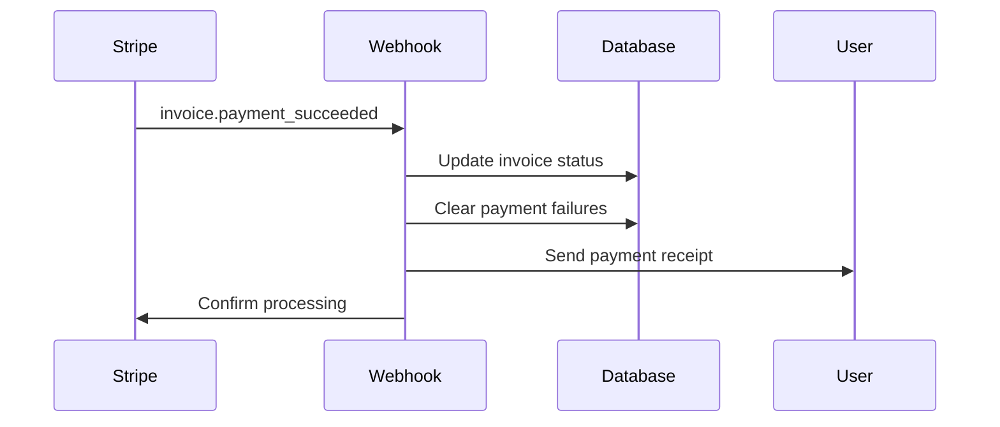
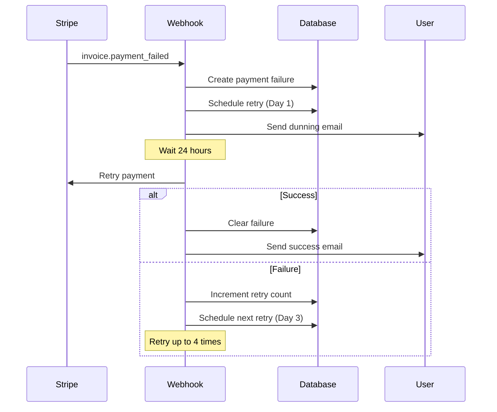
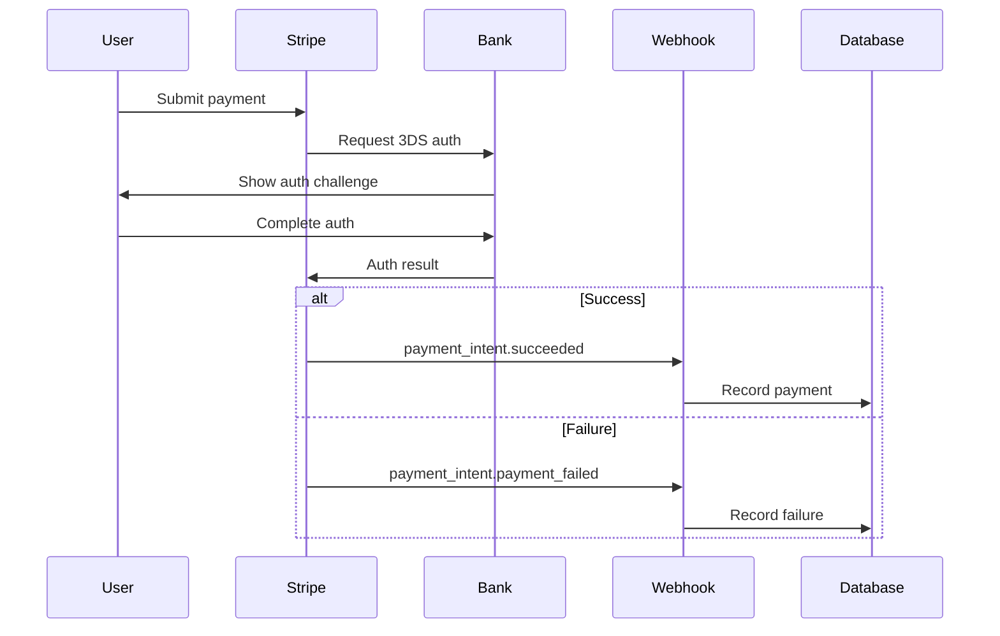

# CÁRIS Payment Integration Documentation

Complete guide to the Stripe payment integration for the CÁRIS mental health platform.

## Table of Contents

1. [Overview](#overview)
2. [Architecture](#architecture)
3. [Setup Instructions](#setup-instructions)
4. [Payment Flows](#payment-flows)
5. [Testing Guide](#testing-guide)
6. [Webhook Configuration](#webhook-configuration)
7. [Security & Compliance](#security--compliance)
8. [API Reference](#api-reference)
9. [Troubleshooting](#troubleshooting)
10. [Common Issues](#common-issues)

---

## Overview

The CÁRIS payment system is built on Stripe and provides:

- **Subscription Management**: Recurring billing for Essential, Professional, and Clinic plans
- **Payment Processing**: Secure card payments with 3D Secure (SCA) support
- **Invoice Management**: Automated invoice generation and email delivery
- **Dunning Management**: Automatic retry logic for failed payments
- **Customer Portal**: Self-service billing management
- **Admin Dashboard**: Revenue analytics and payment monitoring
- **Audit Trail**: Comprehensive logging for compliance and debugging

### Supported Plans

| Plan | Monthly Price | Yearly Price | Features |
|------|--------------|--------------|----------|
| Essential | R$ 79.00 | R$ 790.00 (2 months free) | Up to 10 patients, basic features |
| Professional | R$ 129.00 | R$ 1,290.00 (2 months free) | Unlimited patients, AI features |
| Clinic | R$ 299.00 | R$ 2,990.00 (2 months free) | Multi-therapist, white-label options |

---

## Architecture

### System Components

```
┌─────────────────┐
│   Frontend      │
│  (Next.js 15)   │
└────────┬────────┘
         │
         ├─────────────────────────────────────┐
         │                                     │
         v                                     v
┌─────────────────┐                  ┌──────────────────┐
│  Stripe.js      │                  │  API Routes      │
│  (Client SDK)   │                  │  /api/stripe/*   │
└─────────────────┘                  └────────┬─────────┘
                                              │
                                              v
                                     ┌──────────────────┐
                                     │  Payment Handler │
                                     │  (lib/payment-   │
                                     │   handler.ts)    │
                                     └────────┬─────────┘
                                              │
                         ┌────────────────────┼────────────────────┐
                         v                    v                    v
                ┌─────────────────┐  ┌──────────────┐    ┌─────────────┐
                │  Stripe API     │  │  Database    │    │  Audit Log  │
                │  (stripe.com)   │  │  (PostgreSQL)│    │  System     │
                └─────────────────┘  └──────────────┘    └─────────────┘
                         │
                         v
                ┌─────────────────┐
                │  Webhooks       │
                │  /api/webhooks/ │
                │  stripe/route.ts│
                └─────────────────┘
```

### Key Files

```
/home/user/CARIS/
├── lib/
│   ├── stripe.ts                    # Stripe client & service methods
│   ├── payment-handler.ts           # Payment processing & retry logic
│   ├── invoice-management.ts        # Invoice generation & management
│   └── payment-audit.ts             # Audit logging & security
│
├── app/
│   ├── api/
│   │   ├── stripe/
│   │   │   ├── subscriptions/route.ts       # Subscription CRUD
│   │   │   ├── billing/route.ts             # Billing info & invoices
│   │   │   └── checkout/session/route.ts    # Checkout session creation
│   │   └── webhooks/
│   │       └── stripe/route.ts              # Webhook event handler
│   │
│   ├── admin/payments/page.tsx      # Admin payment dashboard
│   └── dashboard/(patient)/billing/page.tsx # Customer billing portal
│
├── __tests__/
│   └── integration/
│       └── payment-flow.test.ts     # Integration tests
│
└── docs/
    └── PAYMENT_INTEGRATION.md       # This file
```

### Database Schema

```sql
-- Customers
CREATE TABLE customers (
  id UUID PRIMARY KEY,
  user_id INTEGER REFERENCES users(id),
  stripe_customer_id TEXT UNIQUE,
  email TEXT,
  name TEXT,
  created_at TIMESTAMP,
  updated_at TIMESTAMP
);

-- Subscriptions
CREATE TABLE subscriptions (
  id UUID PRIMARY KEY,
  user_id INTEGER REFERENCES users(id),
  customer_id UUID REFERENCES customers(id),
  stripe_subscription_id TEXT UNIQUE,
  status TEXT,
  plan_id TEXT,
  plan_name TEXT,
  price_id TEXT,
  current_period_start TIMESTAMP,
  current_period_end TIMESTAMP,
  cancel_at_period_end BOOLEAN,
  canceled_at TIMESTAMP,
  created_at TIMESTAMP,
  updated_at TIMESTAMP
);

-- Payments
CREATE TABLE payments (
  id UUID PRIMARY KEY,
  user_id INTEGER REFERENCES users(id),
  subscription_id UUID REFERENCES subscriptions(id),
  stripe_payment_intent_id TEXT UNIQUE,
  stripe_charge_id TEXT,
  amount INTEGER,
  currency TEXT,
  status TEXT,
  description TEXT,
  receipt_url TEXT,
  failure_reason TEXT,
  created_at TIMESTAMP,
  updated_at TIMESTAMP
);

-- Invoices
CREATE TABLE invoices (
  id UUID PRIMARY KEY,
  user_id INTEGER REFERENCES users(id),
  subscription_id UUID REFERENCES subscriptions(id),
  stripe_invoice_id TEXT UNIQUE,
  invoice_number TEXT,
  status TEXT,
  amount_due INTEGER,
  amount_paid INTEGER,
  currency TEXT,
  description TEXT,
  hosted_invoice_url TEXT,
  invoice_pdf TEXT,
  due_date TIMESTAMP,
  paid_at TIMESTAMP,
  created_at TIMESTAMP,
  updated_at TIMESTAMP
);

-- Payment Failures
CREATE TABLE payment_failures (
  id UUID PRIMARY KEY,
  user_id INTEGER REFERENCES users(id),
  subscription_id UUID REFERENCES subscriptions(id),
  payment_id UUID REFERENCES payments(id),
  failure_code TEXT,
  failure_message TEXT,
  retry_count INTEGER,
  next_retry_at TIMESTAMP,
  resolved_at TIMESTAMP,
  created_at TIMESTAMP,
  updated_at TIMESTAMP
);

-- Webhook Events (for idempotency)
CREATE TABLE webhook_events (
  id UUID PRIMARY KEY,
  stripe_event_id TEXT UNIQUE,
  event_type TEXT,
  event_data JSONB,
  processed BOOLEAN,
  error TEXT,
  processed_at TIMESTAMP,
  created_at TIMESTAMP,
  updated_at TIMESTAMP
);

-- Audit Logs
CREATE TABLE payment_audit_logs (
  id UUID PRIMARY KEY,
  user_id INTEGER REFERENCES users(id),
  action TEXT,
  entity TEXT,
  entity_id TEXT,
  metadata JSONB,
  ip_address TEXT,
  user_agent TEXT,
  created_at TIMESTAMP
);
```

---

## Setup Instructions

### 1. Environment Variables

Add to `.env.local`:

```bash
# Stripe Keys (get from https://dashboard.stripe.com/apikeys)
STRIPE_SECRET_KEY=sk_test_...
NEXT_PUBLIC_STRIPE_PUBLISHABLE_KEY=pk_test_...
STRIPE_WEBHOOK_SECRET=whsec_...

# Stripe Price IDs (create in Stripe Dashboard)
STRIPE_PRICE_ESSENTIAL_MONTHLY=price_...
STRIPE_PRICE_ESSENTIAL_YEARLY=price_...
STRIPE_PRICE_PROFESSIONAL_MONTHLY=price_...
STRIPE_PRICE_PROFESSIONAL_YEARLY=price_...
STRIPE_PRICE_CLINIC_MONTHLY=price_...
STRIPE_PRICE_CLINIC_YEARLY=price_...

# Application URL
NEXT_PUBLIC_APP_URL=https://your-app.com
```

### 2. Create Stripe Products & Prices

Using Stripe CLI:

```bash
# Essential Plan
stripe products create --name="CÁRIS Essencial" --description="Para psicólogos autônomos"
stripe prices create --product=prod_xxx --unit-amount=7900 --currency=brl --recurring[interval]=month
stripe prices create --product=prod_xxx --unit-amount=79000 --currency=brl --recurring[interval]=year

# Professional Plan
stripe products create --name="CÁRIS Profissional" --description="Solução completa"
stripe prices create --product=prod_xxx --unit-amount=12900 --currency=brl --recurring[interval]=month
stripe prices create --product=prod_xxx --unit-amount=129000 --currency=brl --recurring[interval]=year

# Clinic Plan
stripe products create --name="CÁRIS Clínica" --description="Para clínicas e equipes"
stripe prices create --product=prod_xxx --unit-amount=29900 --currency=brl --recurring[interval]=month
stripe prices create --product=prod_xxx --unit-amount=299000 --currency=brl --recurring[interval]=year
```

### 3. Configure Webhook Endpoint

1. Go to Stripe Dashboard → Developers → Webhooks
2. Add endpoint: `https://your-app.com/api/webhooks/stripe`
3. Select events:
   - `checkout.session.completed`
   - `customer.subscription.*`
   - `invoice.*`
   - `payment_intent.*`
   - `charge.*`
4. Copy webhook signing secret to `STRIPE_WEBHOOK_SECRET`

### 4. Database Migration

```bash
# Generate migration
pnpm db:generate

# Apply migration
pnpm db:migrate

# Seed initial data (if needed)
pnpm db:seed
```

### 5. Install Dependencies

All required packages are already in `package.json`:

```bash
pnpm install
```

---

## Payment Flows

### 1. New Subscription Flow



### 2. Payment Success Flow



### 3. Payment Failure & Retry Flow



### 4. 3D Secure (SCA) Flow



---

## Testing Guide

### Test Cards

Use these card numbers in Stripe test mode:

| Scenario | Card Number | CVC | Expiry |
|----------|-------------|-----|--------|
| Success | `4242 4242 4242 4242` | Any 3 digits | Any future date |
| Decline | `4000 0000 0000 0002` | Any 3 digits | Any future date |
| Requires 3DS | `4000 0025 0000 3155` | Any 3 digits | Any future date |
| Insufficient funds | `4000 0000 0000 9995` | Any 3 digits | Any future date |

### Running Tests

```bash
# Run all tests
pnpm test

# Run payment integration tests
pnpm test:integration -- payment-flow.test.ts

# Run with coverage
pnpm test:coverage
```

### Manual Testing Checklist

- [ ] Create new subscription
- [ ] Successful payment with regular card
- [ ] Failed payment handling
- [ ] 3D Secure authentication
- [ ] Invoice generation and email
- [ ] Payment method update
- [ ] Subscription upgrade/downgrade
- [ ] Subscription cancellation
- [ ] Subscription reactivation
- [ ] Payment retry after failure
- [ ] Webhook signature verification
- [ ] Admin dashboard data display
- [ ] Customer portal navigation

---

## Webhook Configuration

### Local Development Testing

Use Stripe CLI to forward webhooks:

```bash
# Login to Stripe
stripe login

# Forward webhooks to local server
stripe listen --forward-to localhost:3000/api/webhooks/stripe

# Test specific event
stripe trigger payment_intent.succeeded
```

### Production Webhook Setup

1. **Configure endpoint**: `https://your-app.com/api/webhooks/stripe`
2. **Select API version**: `2024-12-18.acacia`
3. **Events to listen for**:
   ```
   checkout.session.completed
   checkout.session.expired
   customer.created
   customer.updated
   customer.deleted
   customer.subscription.created
   customer.subscription.updated
   customer.subscription.deleted
   customer.subscription.trial_will_end
   invoice.created
   invoice.finalized
   invoice.payment_succeeded
   invoice.payment_failed
   invoice.payment_action_required
   payment_intent.created
   payment_intent.succeeded
   payment_intent.payment_failed
   payment_intent.requires_action
   payment_method.attached
   payment_method.detached
   charge.succeeded
   charge.failed
   charge.refunded
   charge.dispute.created
   charge.dispute.updated
   ```

### Webhook Monitoring

Check webhook logs in Stripe Dashboard:
- Go to Developers → Webhooks
- Click on your endpoint
- View recent deliveries and responses
- Retry failed webhook deliveries

---

## Security & Compliance

### PCI Compliance

✅ **We are PCI compliant because:**
- Never store card data (handled by Stripe)
- Use Stripe.js for client-side tokenization
- Only store Stripe customer/payment IDs
- All communication over HTTPS
- Webhook signature verification

### Security Measures

1. **Webhook Signature Verification**
   ```typescript
   const event = stripe.webhooks.constructEvent(
     body,
     signature,
     webhookSecret
   )
   ```

2. **Idempotency Handling**
   - Check webhook event ID before processing
   - Prevent duplicate payment processing

3. **Rate Limiting**
   - Implement rate limits on payment endpoints
   - Prevent abuse and brute force attacks

4. **Audit Logging**
   - Log all payment actions
   - Track suspicious activity
   - Maintain compliance trail

5. **Fraud Detection**
   - Monitor transaction patterns
   - Flag high-risk payments
   - Alert on suspicious activity

### Data Privacy (LGPD/GDPR)

- Customer data encrypted at rest
- Personal data can be exported
- Right to deletion supported
- Data retention policies enforced
- Audit trail for data access

---

## API Reference

### Subscriptions

#### Create Subscription

```typescript
POST /api/stripe/subscriptions

Request:
{
  "planId": "professional",
  "interval": "monthly",
  "email": "user@example.com",
  "name": "John Doe"
}

Response:
{
  "success": true,
  "sessionId": "cs_test_...",
  "sessionUrl": "https://checkout.stripe.com/pay/..."
}
```

#### Get Subscription

```typescript
GET /api/stripe/subscriptions

Response:
{
  "subscription": {
    "id": "sub_...",
    "status": "active",
    "planId": "professional",
    "planName": "Profissional",
    "currentPeriodStart": "2025-01-01T00:00:00Z",
    "currentPeriodEnd": "2025-02-01T00:00:00Z",
    "cancelAtPeriodEnd": false
  }
}
```

### Billing

#### Get Billing Info

```typescript
GET /api/stripe/billing

Response:
{
  "subscription": {...},
  "paymentMethods": [...],
  "invoices": [...],
  "paymentFailures": [...]
}
```

#### Manage Billing

```typescript
POST /api/stripe/billing

Request (Create Setup Intent):
{
  "action": "create_setup_intent"
}

Request (Retry Payment):
{
  "action": "retry_payment",
  "invoiceId": "inv_..."
}

Request (Download Invoice):
{
  "action": "download_invoice",
  "invoiceId": "inv_..."
}
```

### Admin APIs

#### Get Payment Stats

```typescript
GET /api/admin/payments/stats?range=30d

Response:
{
  "stats": {
    "totalRevenue": 1500000,
    "monthlyRevenue": 250000,
    "activeSubscriptions": 193,
    "failedPayments": 5,
    "revenueGrowth": 15.3
  }
}
```

---

## Troubleshooting

### Common Errors

#### "Invalid API Key"
**Cause**: Wrong or missing Stripe API key
**Solution**: Check `STRIPE_SECRET_KEY` in `.env.local`

#### "Webhook signature verification failed"
**Cause**: Incorrect webhook secret
**Solution**: Copy signing secret from Stripe Dashboard → Webhooks

#### "No such price"
**Cause**: Price ID not found in Stripe
**Solution**: Create prices in Stripe Dashboard and update env vars

#### "Payment requires authentication"
**Cause**: 3D Secure required but not handled
**Solution**: Use Stripe Elements with `handleCardAction()`

### Debug Mode

Enable debug logging:

```typescript
// In lib/stripe.ts
const stripe = new Stripe(process.env.STRIPE_SECRET_KEY, {
  apiVersion: '2024-12-18.acacia',
  typescript: true,
  // Add this:
  maxNetworkRetries: 2,
  timeout: 10000,
})
```

### Webhook Testing

Test webhook locally:

```bash
# Start your dev server
pnpm dev

# In another terminal, forward webhooks
stripe listen --forward-to localhost:3000/api/webhooks/stripe

# Trigger test event
stripe trigger payment_intent.succeeded
```

---

## Common Issues

### Issue: Subscription not created after payment

**Diagnosis**: Check webhook events in Stripe Dashboard
**Solution**: Ensure webhook endpoint is accessible and signature is valid

### Issue: Failed payment not retrying

**Diagnosis**: Check `payment_failures` table and `nextRetryAt` field
**Solution**: Run cron job to process pending retries:

```typescript
import { PaymentHandler } from '@/lib/payment-handler'

// In your cron job
await PaymentHandler.processPendingRetries()
```

### Issue: Customer sees wrong plan details

**Diagnosis**: Plan metadata mismatch
**Solution**: Update subscription metadata in Stripe:

```bash
stripe subscriptions update sub_xxx --metadata[planId]=professional
```

### Issue: Invoice email not sent

**Diagnosis**: Check email service logs
**Solution**: Verify email service configuration and retry:

```typescript
import { InvoiceManager } from '@/lib/invoice-management'

await InvoiceManager.sendInvoiceEmail(invoiceId)
```

---

## Monitoring & Alerts

### Key Metrics to Monitor

1. **Payment Success Rate**: Should be >95%
2. **Failed Payment Count**: Monitor daily
3. **Webhook Delivery Rate**: Should be >99%
4. **Subscription Churn Rate**: Monthly tracking
5. **Average Revenue Per User**: Growth indicator

### Set Up Alerts

```typescript
// Example alert conditions
if (failedPaymentRate > 0.05) {
  sendAlert('High payment failure rate')
}

if (webhookFailureRate > 0.01) {
  sendAlert('Webhook delivery issues')
}

if (disputeCount > 0) {
  sendAlert('Payment dispute received')
}
```

---

## Support & Resources

### Documentation
- [Stripe API Docs](https://stripe.com/docs/api)
- [Stripe Testing Guide](https://stripe.com/docs/testing)
- [SCA/3DS Guide](https://stripe.com/docs/strong-customer-authentication)

### Stripe Dashboard
- [Dashboard](https://dashboard.stripe.com)
- [Logs](https://dashboard.stripe.com/logs)
- [Webhooks](https://dashboard.stripe.com/webhooks)

### Internal Team
- Payment Issues: payments@caris.com.br
- Technical Support: tech@caris.com.br
- Security: security@caris.com.br

---

## Changelog

### v1.0.0 (2025-11-12)
- ✨ Initial payment integration
- ✨ Subscription management
- ✨ Invoice generation
- ✨ Dunning management
- ✨ Admin dashboard
- ✨ Customer portal
- ✨ Comprehensive webhook handling
- ✨ Audit logging system
- ✨ Integration tests

---

## License

Internal documentation for CÁRIS platform. Not for public distribution.

Copyright © 2025 CÁRIS. All rights reserved.
